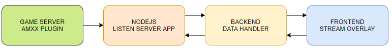

# CS Hud Observer :video_camera:

CS Hud Observer is stream overlay for CS 1.6 
Basic idea behind this stream overlay is to show currently non existing game status to stream watcher.


## Idea

Using game server stream events over socket (TCP/ UDP) to local streamer who will run this software which will display data to stream watchers.

## Unluko things

CS 1.6 game server doesnt have native event stream like CSGO, so everything needs to be recreated in AmxModX.

## Work (CSS idea)


## Instalation

### Short explanation
Native HLDS or ReHLDS server doesnt have any stream method unlike CSGO to send game events to specific endpoint (there is remote logging, but information sended is sufficial).
So to make this project work we had to recreate that feature in AmxModX. 
For connections we use TCP sockets, and full diagram of connections is like below.



### Game server instalation & configuration
Whole thing is builded and tested on ReHLDS. There is many advantages over native HLDS so I would reccommend using it since Valve is likely never gonna fix issues reported in HLDS.  

For scripting AmxModX is used and socket module. 
**Version recommended is 1.9** and modules related.  

Most important, server performance is not affected by running this plugin. On normal 300fps server with no clocked bandwith, plugin performs good. Tests will be provided in future.

Currently there is no Docker image or Vagrant support, but its on the way (TODO).


**Nodejs install**

**Nodejs** is required on local (game) or remote machine. Version recommended - **latest version**.  

*If you have nodejs installed, skip this step*
For Debian and Ubuntu you can use following commands to install nodejs
```sh 
# Update latest system packages
$ sudo apt update 

# Install node with -y parm to accept all incoming confirmations
$ sudo apt install nodejs -y

# After all is installed, check do we have nodejs installed
$ node -v

# If you see numbers, you are good to go :D 
# npm is not required since no 3rd party packages are used
```
Before running script we need to create **config.js** file. We can grab **config.example.js** data for example and paste it new **config.js** 

Config data:  
*   **token**: token used for authentication with clint. This field can empty, app will generate auth key or you can write down own token.
*   **port**: local port of app. This is required for a game and client.
*   **address**: game server ip address. If app runs on same server as game write **127.0.0.1** or if you use remote game server, use that remote address.

Note: config.js need to be in same dir as **game.js**.

Manualy place **game.js** and run it with command

```sh
$ node game.js
```

There should be message logged in terminal if its all good.  

*Why we use node app?*  
Reason is simple, game server with native socket module cant listen for incoming connections. Another reason is easier auth and preparing outgoing data.


**Plugin install** 
Procedure for plugin install is standard. 
Put Events.amxx into **addons/metamod/amxmodx/plugins/** and register it in the **addons/metamod/amxmodx/configs/plugins.ini**

```
;plugins.ini
Events.amxx
```

In **scripting** directory plugin source code is available, you can compile it manually.


## Documentation

[Events list (typescript documentation)](https://github.com/kallefrombosnia/cs-hud-observer/blob/master/docs/EVENTS.md)    
[Internal event list (typescript documentation)](https://github.com/kallefrombosnia/cs-hud-observer/blob/master/docs/INTERNAL_EVENTS.md)  
[Scripting reference](https://github.com/kallefrombosnia/cs-hud-observer/blob/master/game)    

## REST API

Info provided below will be rewritten in future.

| ENDPOINT               | METHOD | RETURN                 | NOTE                              |
|------------------------|--------|------------------------|-----------------------------------|
| `/api/matches/info`    | GET    | Matches list           |                                   |
| `/api/addmatch`        | POST   |                        | Add a new match to the database   |
| `/api/view/match/:id`  | GET    | Specific match info    | :id -> match id                   |
| `/api/editmatch`       | POST   |                        | ID of a match is necessary        |
| `/api/addplayer`       | POST   |                        | Adds a new player to the database |
| `/api/view/player/:id` | GET    | Specific player info   | :id -> player id                  |
| `/api/editplayer`      | POST   |                        | ID of a player is necessary       |
| `/api/players`         | GET    | Gets all players list  |                                   |
| `/api/teams`           | GET    | Teams list             |                                   |
| `/api/addclan`         | POST   |                        | Add a new team to the database    |
| `/api/view/team/:id`   | GET    | Get specific team info |                                   |
| `/api/editclan`        | POST   |                        | ID of a match is necessary        |


## Contributing
Special thanks to: 

* [Damper](https://github.com/Bog1sh4) for creating amxx plugins
* [guxi](https://github.com/4nte) for React help
* [Fastcup](https://cs.fastcup.net) for informations


## License
[MIT](https://choosealicense.com/licenses/mit/)